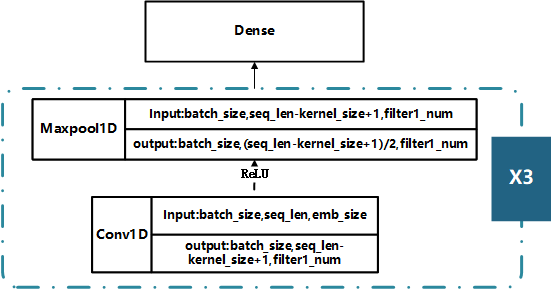

# 课设进度

任务类型：对话生成任务

数据库：词向量训练（网络爬取的新闻数据，代码详见 data\scrapy_baidu-master文件夹）&& 对话训练数据（使用github上的公开数据集：[codemayq/chinese_chatbot_corpus: 中文公开聊天语料库 (github.com)](https://github.com/codemayq/chinese_chatbot_corpus)）

> 第一周：使用爬虫爬取网络新闻数据，并以此数据为基础构建词向量

CNN模型结构

