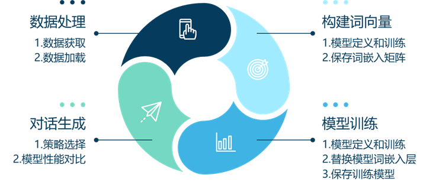
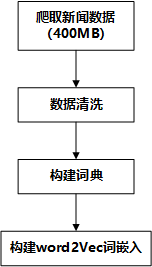
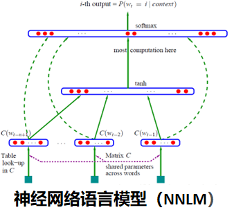
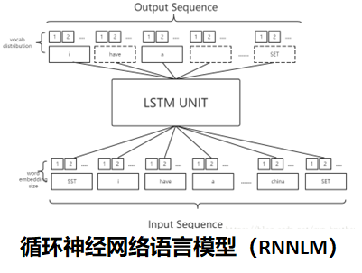
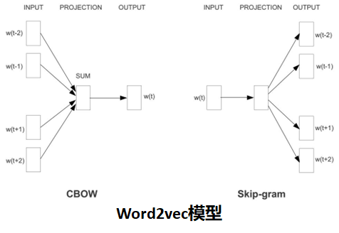
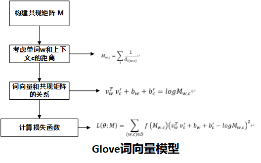
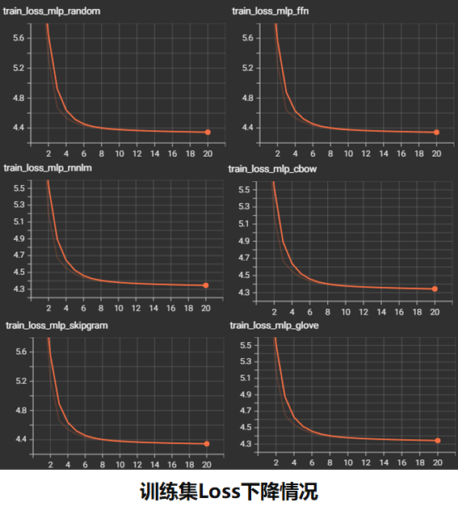
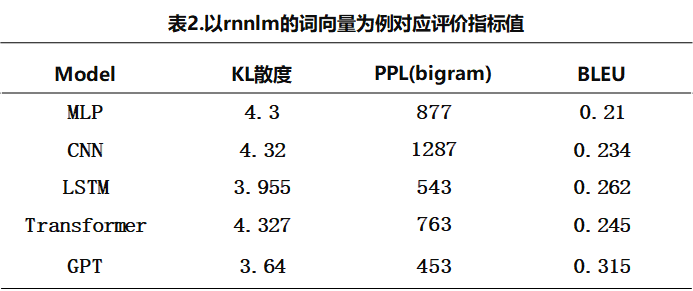

# 选题和数据集
任务类型：对话生成任务

数据集：
- 词向量训练（网络爬取的新闻数据，代码详见 data\scrapy_baidu-master文件夹）
- 对话训练数据（使用github上的公开数据集：[codemayq/chinese_chatbot_corpus: 中文公开聊天语料库 (github.com)](https://github.com/codemayq/chinese_chatbot_corpus)）

整体代码详见(以上传github):https://github.com/JiangZhijianZhejaing/NLP_ClassDesign

## 开发环境
    - pytorch==1.3.1
    - sklearn==0.19.2
    - scipy==1.4.1
    - numpy==1.18.5
    - jieba==0.42.1
    - pandas==0.23.4
    - torchvision==0.5.0
    - transformers==2.1.1  


## 文件目录  
```
│  .gitignore
│  README.md
│     
├─config                    #基本配置调用huggingface的库函数使用
│         
├─data                      #存放数据和爬虫代码
|
├─gpt_2                     #gpt模型的训练代码
│  │  dataset.py
│  │  gpt_train.py
│  │  predict.py
│  │  ...
│          
├─log                       #tensotboard日志文件和模型训练曲线绘制
│          
├─model                     #模型的训练结果的保存路径
│          
├─net                       #神经网络模型的定义文件
│                  
└─word2vec                  #词向量模型的定义文件

```


# 课设进度


## 第一周：选题获取数据集
1. 课程设计整体流程

   
   

2. 撰写爬虫爬取网络新闻数据，并以此数据为基础构建词向量。在遵循网站robot协议的情况下，使用selemium爬虫获取了约500MB的新闻数据用于训练词向量模型；同时使用开源的常见中文闲聊训练下游任务，该数据集包含经过预处理的中文场景下问答的原始语料共计50万个。 

   

 


## 第二周：编写word2vec代码

1. 撰写对应的模型：包含NNLM、RNNLM、Word2vec、CBOW、skip-gram、Glove。保存对应的词向量模型

   

   

   

   

## 第三周：编写神经网络模型

编写对应的神经网络模型及其参数

| **模型类型**    | **参数量** | **Batch_size** | **Learing_rate** | **Epochs** |
| --------------- | ---------- | -------------- | ---------------- | ---------- |
| **MLP**         | 2154495    | 128            | 2e-3             | 20         |
| **LSTM**        | 2401918    | 128            | 2e-3             | 20         |
| **CNN**         | 2634782    | 128            | 2e-3             | 20         |
| **Transformer** | 7147134    | 32             | 2e-4             | 20         |
| **GPT**         | 96069888   | 8              | 5e-5             | 20         |

## 第四周：模型训练和对应的评价指标

1. 使用tensorboard监督模型的训练过程



2. 模型及其最终评价指标

## 第五周：撰写课设报告
